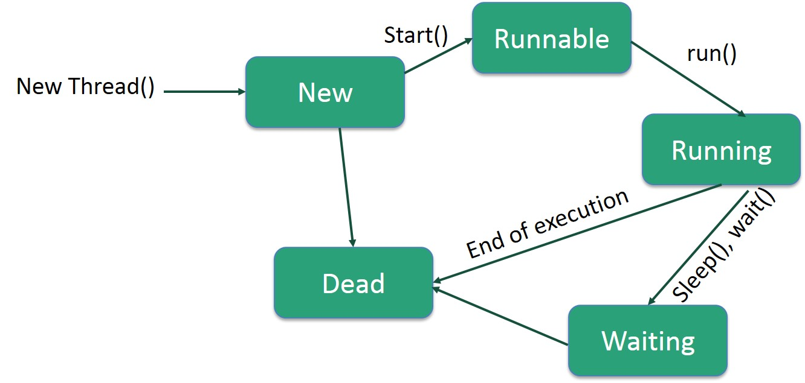

## Java thread
A thread goes through various stages in its life cycle, from born, started, run to die. 



New: a new thread begins its life cycle in the new state. It remains in this state until program starts the thread.

Runnable: After the thread is started, the thread becomes runnable. the run () methon will be invoked.

Waiting: the thread wait fo another thread to preform a task

Terminate: A runnable thread enters the ternimated state when it completes its task.

 When having the Runnable's executed by a thread pool it is easy to queue up the Runnable instances until a thread from the pool is idle. This is a little harder to do with Thread subclasses.

 **Common Pitfall**: Calling run() Instead of start()
When creating and starting a thread a common mistake is to call the run() method of the Thread instead of start(), like this:

```
 Thread newThread = new Thread(MyRunnable());
  newThread.run();  //should be start();
```
 
A newThread.start()  method will invoke the run method.

2 ways to create a thread

*by implement runnable interface*
1. implement the *run()* method
`public void run()`
2. instantiate a thread object by using follow constructor
`Thread(Runnable threadObj, String threadName)`
3. once a thread object is created, start it by calling *start()* method, which executes a call to *run()* method


*by extending thread class*
1. override *run()* method in thread class, put the business logic here
2. once the thread object is created, start it by calling *start()* method

**Concurrent computing**
Break one problem into several parts,
start solving one part first. Then pause it and switch to another task. Later we can again focus on the first. This is the style of concurrent computing.

**Parallel computing** 
Break one problem into several parts,
simulatneously solve 2 or more parts


**Synchronization**

To stop race conditions, a idea "only one at time" can be used.

Keep it simple, when access to a shared resoure. firstly , set a lock for the resoure, then release the lock after processing. 
In code, this can be achieved by *synchronized method* and *synchronized statment*

Synchronized statement
Syntax of a synchronized statement is:
```
synchronized (object){    
     //statements;
}
```
**Volatile Variables**

>Suppose there’s a shared variable called x. This x is used by two threads. Suppose the two threads are running on two processors. Each processor has a built-in memory area close to it. So the system prefers to store the variable values associated with the thread in this memory. Because, accessing this memory is much faster. So, what happens is that each thread has its own cache memory about the variable x. In other words, a copy of x.

>Then, if one thread changes the value of x, the change is not visible to the other thread instantly, as the cache memory x is different. So, volatile variables are used in order to avoid this problem and perform successful thread-to-thread communication.


>private volatile int x;


>The keyword volatile is used to show that a thread should not store a cache memory about this variable x. So the threads have to directly access x and therefore get the latest value. Note that, the race conditions are NOT avoided by volatile variables. As I have mentioned earlier, synchronization is the method to avoid race conditions.


**Join()**
The join() method is used to hold the execution of currently running thread until the specified thread is dead(finished execution). 

 **wait(), notify() & notifyAll() for Inter-Thread Synchronization**
 These methods are defined in the java.lang.Object class These methods can only be called in the synchronous codes.

The wait() and notify() methods provide a way for a shared object to pause a thread when it becomes unavailable to that thread and to allow the thread to continue when appropriate.


现代操作系统提供了三种构造并发程序的方法：
 * 进程， 每个逻辑控制流都是一个进程，由内核调度和维护。 进程有独立的虚拟空间，与其他流通信， 控制流使用进程通信机制（interprocess communication，IPC） 
 * I/O 多路复用 应用程序在一个进程的上下文中调度自己的逻辑流。 逻辑流被模型化为状态机，数据到达文件描述符后，主程序从一个状态转化到另一个状态。 应用程序是个单独的进程，所有的流共享同一个地址空间
 *  线程 是运行在一个单一进程上下文的逻辑流，由内核调度。可以把线程看成上述两种方式的混合，像进程流一样由内核调度，像I/O 多路复用流一样公用同一个虚拟地址空间

Refernce:
1. http://www.geek-programmer.com/java-thread-synchronization-deadlocks-volatile-variables/

2. https://www3.ntu.edu.sg/home/ehchua/programming/java/j5e_multithreading.htm
3. http://www.baeldung.com/java-wait-notify